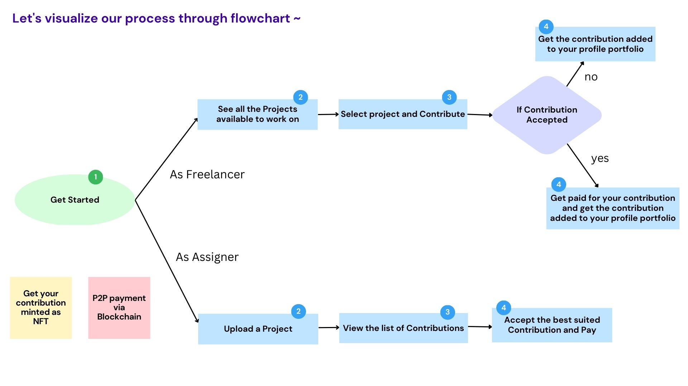
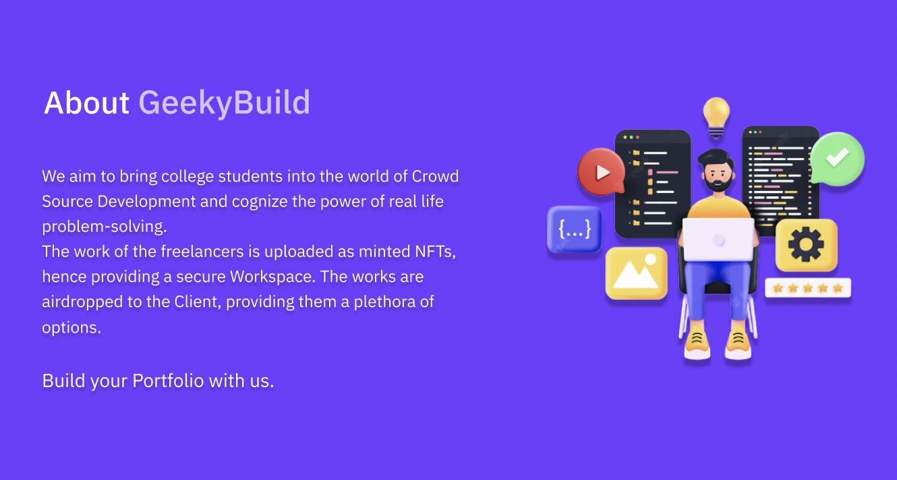
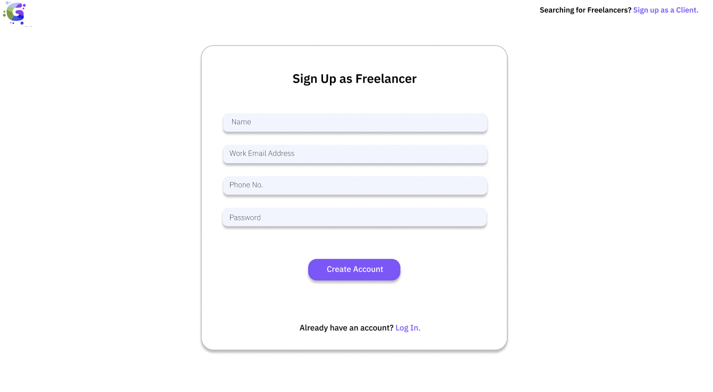
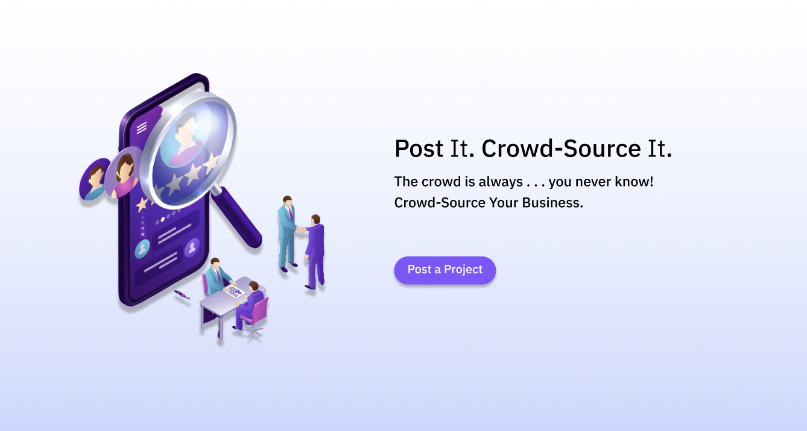
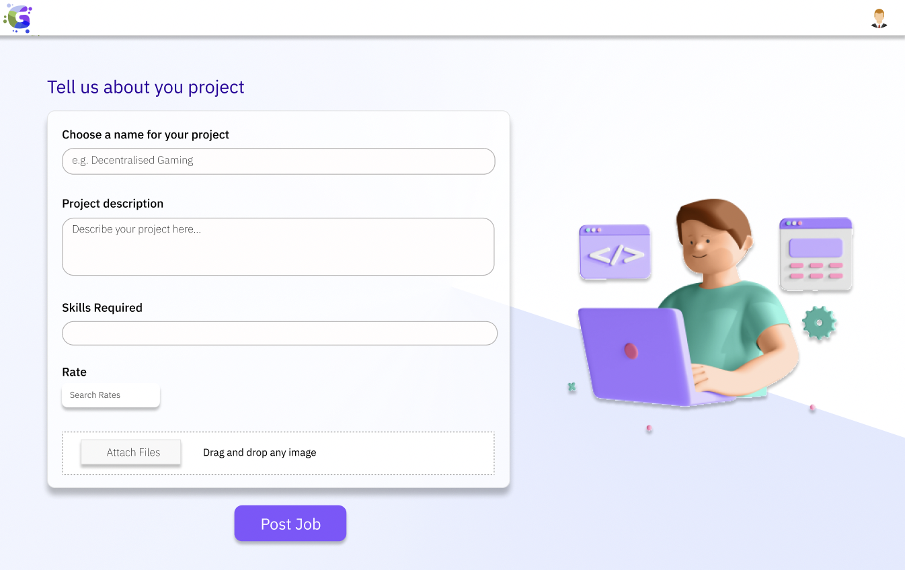

<h1 align="center">GeekyBuild</h1>

 <b>Introducing Crowd-Source to Freelancing where everyone gets equal opportunity to participate. The geeks can upload their work on the platform which is minted as NFT and gets airdropped to the client once it is accepted and transaction takes place by P2P transfer of payment OnChain regulated by Smart Contract.</b>
<h3 align="left">Build your Portfolio. Crowd-Source Your Business.</h3>

-----

## 🤷🏻‍♀️  Why GeekyBuild?

<b>For Freelancer :</b>
- We provide a secure Workspace - plagiarism free. All your works are hoarded in your Portfolio as NFTs.
- Beginner? But have the skills? We will give you the genuine exposure you deserve. Grow with the opportunities with provide you with.
- Make your project stand out and get Paid.
- Contribute to projects of any Company and your Portfolio will showcase your authentic works.
- Use of P2P payment on blockchain handled by Smart Contracts which allows freelancers to automatically receive the payment once their work gets accepted by the project client.
- With increased competition among varied freelancers, fair prices will be fixed.

<b>For Client :</b>
- Get your job done at a fair price.
- Choose the best work from the plethora of submissions by the freelancers.
- Crowdsourcing platforms bring together freelancers with a wide range of skills and expertise, providing clients with access to a larger pool of talent.
- Freelancers can offer their services on a project-by-project basis, providing clients with a flexible solution for their needs.
- With more options available, clients can select the best freelancer for their project, resulting in improved quality and increased satisfaction.

 

## 📌 Links :
⋗ Render -  https://geekybuild.onrender.com

⋗ Presentation - https://drive.google.com/file/d/1xkQJhufYZhNdIoFiPv-Lr6UNuhMcTTNb/view?usp=sharing

⋗ Devpost - https://devpost.com/software/geekybuild

⋗ Peerlist - https://peerlist.io/prithasaha2722/project/geekybuild

 

## 💻 Tech Stack :

 

## 📈 Flowchart :

 

## 🪄 UI Designs :

  
  
  

------

## 🧑🏻‍💻 Contributors

    
